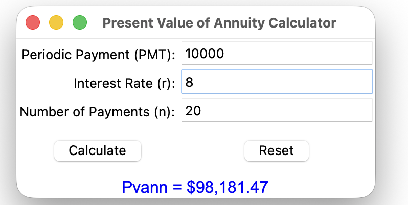
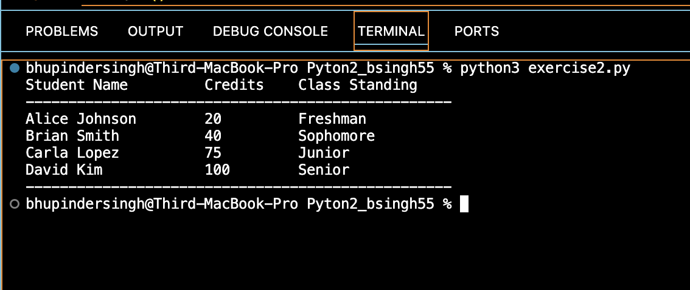

# Python Exercises 2 - Present Value GUI & Class Standing Logic

## Overview

This assignment contains two Python programs based on GUI and OOP concepts:

- **Exercise 1:** A GUI-based Present Value of Annuity Calculator using Tkinter.
- **Exercise 2:** A terminal-based class standing calculator using a custom `Student` class.

---

## Exercise 1: Present Value of Annuity (Pvann) Calculator

### Description
A Tkinter-based Python GUI app that calculates the **present value of an annuity** using the following formula: 
Pvann = PMT * [1 - (1 + r)^-n] / r
Where:
- `PMT` = Periodic Payment
- `r` = Interest Rate (in decimal, e.g., 8% → 0.08)
- `n` = Number of Payments

### Features
- Input fields with default values: `PMT=10000`, `r=8`, `n=20`
- `Calculate` button computes and displays the Pvann dynamically
- `Reset` button restores defaults
- Handles invalid or empty inputs gracefully

### Sample Output
For `PMT=10000`, `r=8`, and `n=20`, the output displayed is:
Pvann = $98,181.47
📷 *Screenshot:*  

---

## Exercise 2: Student Class Standing Calculator

### Description
A terminal-based Python script that defines a `Student` class with private attributes and calculates each student's academic standing based on earned credits.

### Class Standing Logic
- **Freshman:** 0–24 credits  
- **Sophomore:** 25–55 credits  
- **Junior:** 56–86 credits  
- **Senior:** 87+ credits  

### Features
- Private attributes (`__first_name`, `__last_name`, `__credits`)
- Method to calculate standing
- Four hardcoded student objects with different credit values
- Neatly formatted tabular output in terminal

### Sample Output
Student Name     Credits   Class Standing

Alice Johnson    20        Freshman
Brian Smith      40        Sophomore
Carla Lopez      75        Junior
David Kim        100       Senior
📷 *Screenshot:*  

---

## Submission Contents
Module2_PythonExercises2/
├── exercise1.py
├── exercise2.py
├── exercise1_output.png
├── exercise2_output.png
└── README.md
---

## Author

**Bhupinder Singh**  
`bsingh55` | Arizona State University
